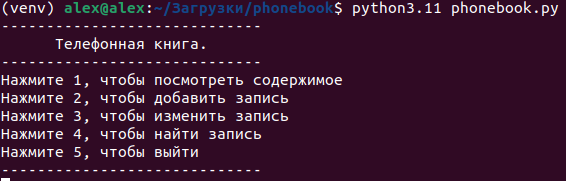
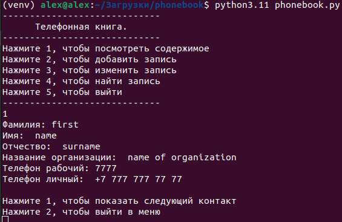
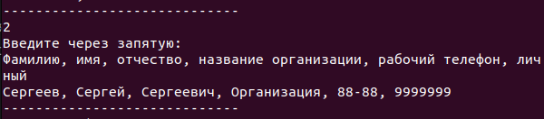
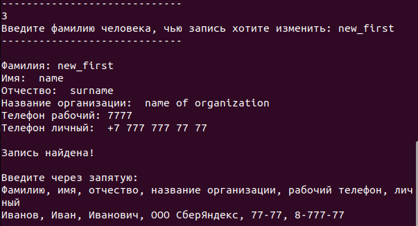
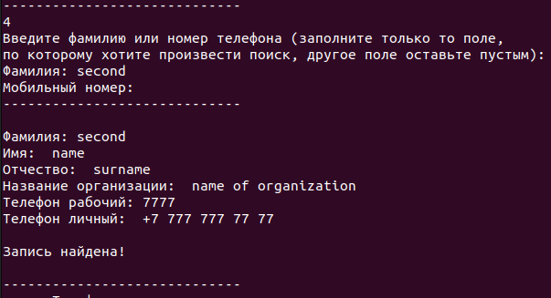

# Телефонный справочник

Телефонный справочник позволяет хранить, добавлять, изменять и искать записи в нем. 
Данные хранятся в файле phonebook.xlsx. Файлы формата *.xlsx имеют ряд преимуществ 
перед обычными текстовыми файлами, так, например они имеют четкую структурированность
и удобный формат отображения информации. Именно поэтому для хранения записей 
телефонного справочника был выбран этот формат.
### Требования

На компьютере должен быть установлен Python и Microsoft Office Excel.
Вы можете использовать для работы файл phonebook.xlsx, который находится в репозитории
или удалить его, тогда при запуске программы он будет создан заново.


### Установка

Во-первых установите Python и pip (команды для Ubuntu)

```
sudo apt-get install python3.11
sudo apt-get install pip
```
Создайте виртуальное окружение
```
python3.11 -m venv venv
source venv/bin/activate    # (Ubuntu)
./venv/Scripts/python       # (Windows)
```

Затем установите необходимые зависимости из файла requirements.txt

```
pip install -r requirements.txt
```
Загрузите последнюю версию программы и запускайте.
```
python3.11 phonebook.py
```

## Инструкция пользователю

Программа имеет консольный интерфейс
<p align="center">

</p>

Вы можете просматривать записи из телефонной книги
<p align="center">

</p>

Добавлять записи в телефонную книгу
<p align="center">

</p>

Изменять запись из телефонной книги
<p align="center">

</p>

Искать запись в телефонной книге
<p align="center">

</p>